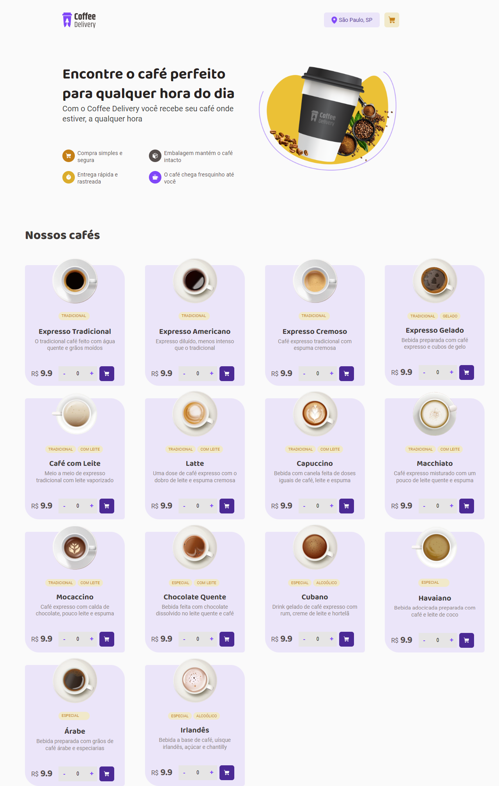
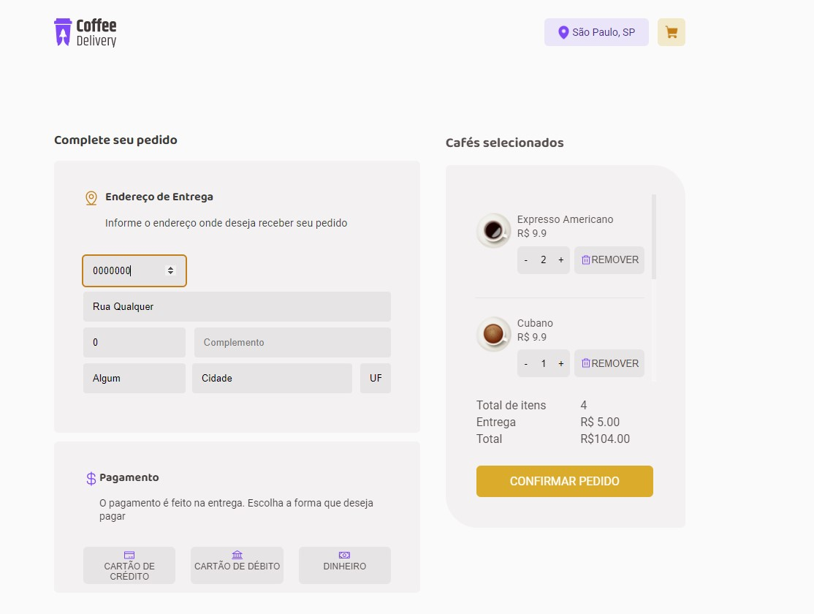
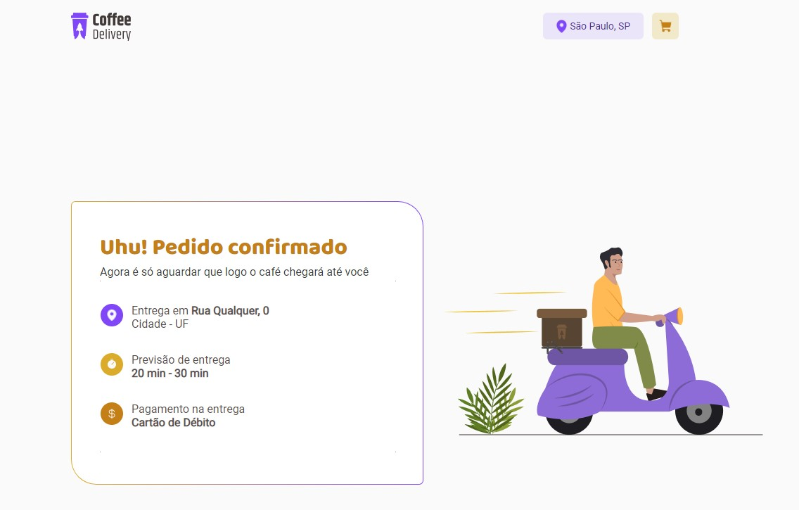

# Coffee Delivery

Atividade desenvolvida durante o curso de React + Typescript da Rocketseat, de
acordo com o [layout proposto nesse endereço:](https://www.figma.com/file/5yT9ZzZmRQRS4yivGGB3pl/Coffee-Delivery/duplicate) .

O objetivo foi criar uma loja virtual com página de catálogo, checkout e pedido confirmado

### Tecnologias envolvidas
- HTML;
- Styled Components (CSS);
- Typescript;
- React JS

### Para rodar o projeto
Em seu terminal de prefêrencia, rode os comandos:
- Clone o projeto
- npm install 
- npm run start

